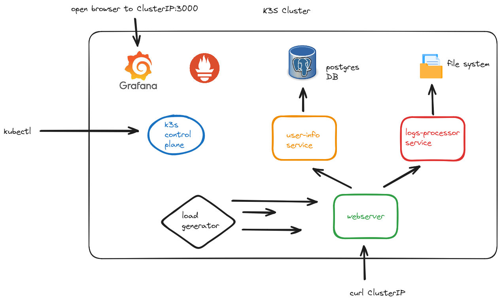
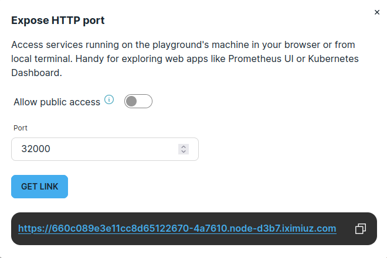

# Iximiuz Manifest Dojo

This is a version of the [K8s Manifest Dojo](https://github.com/lpmi-13/k8s-manifest-dojo) adapted to run on [Iximiuz Labs](https://labs.iximiuz.com).

You'll be presented with a k3s cluster with configuration to present several common scenarios to debug:

-   misconfigured deployment
-   misconfigured ports
-   misconfigured service accounts
-   misconfigured namespaces
-   misconfigured volume constraints
-   misconfigured resource requests and/or limits
-   misconfigured database access
-   misconfigured health checks
-   misconfigured network policies

The actual problem will be chosen on startup of the applications, and you'll see there's an issue by querying pod status or looking in container logs. There's also a grafana pod with a few dashboards based on prometheus data that might also be helpful.

> NOTE: All of the issues will be with the yaml manifests in the `manifests/application` directory. You won't need to change any application code to fix them.

## Architecture



We'll have a few containers running in the cluster in our application namespace (dojo):

-   a flask webserver
-   a server to deal with logs-processing (a bit contrived, but useful for local volume mounts)
-   a server to interact with a database table about users
-   a load generator making requests to the flask webserver that trigger downstream queries to the other services

## Running locally

This is not intended to be run locally. The main issue is that the container registry (`registry.iximiuz.com`) won't be available, so if you'd like to run a version of this locally, then you should use the original [K8s Manifest Dojo](https://github.com/lpmi-13/k8s-manifest-dojo), which was desigend for local use.

## Entering the Dojo

> We run 2 init commands to install podman (which we need because it's easier than installing docker and we want to build and push local images) and perform the initial cluster setup.

The cluster will be started with one problem chosen at random, and you'll need to figure out what it is and how to fix it. Depending on what the issue is, it might take up to 30 seconds for it to be apparent.

> The first place to look is in the spec for the misbehaving service. Since the problem is a misconfigured manifest, that's where you need to fix things. Use the errors to figure out which manifest to look in. You can also check the grafana dashboards for clues.

### Potential issues:

-   misconfigured deployment
-   misconfigured ports
-   misconfigured service accounts
-   misconfigured namespaces
-   misconfigured volume constraints
-   misconfigured resource requests and/or limits
-   misconfigured database access
-   misconfigured health checks
-   misconfigured network policies

> Most of these will probably cause issues with the pods starting up, so it should be fairly obvious that something's wrong, but I'm going to try and have a bunch of variations to keep it spicy

If you'd like to consult the grafana dashboards, you'll need to expose a port externally, which can easily be done via the Expose Prt button in the upper right of the playground. After that, expose port 32000, which is what the grafana service NodePort is using.



The default admin username and password, respectively, are "admin" and "admin".

...you can also just see what pods are running via:

```sh
kubectl -n dojo get po
```

Once you've identified the issue and fixed it, you can set up the next issue by running the `scripts/next_exercise.sh` script. That will pick another misconfiguration at random and redeploy all the services. Follow the same steps from above to troubleshoot and fix it.

### Resetting the cluster from scratch

If, for any reason, you want to reset everything, you can run the k3s "kill all" script at `/usr/local/bin/k3s-killall.sh` (the k3s installer should put it into the `$PATH`). After that, to bring the cluster back up, you can run `sudo systemctl restart k3s`.
